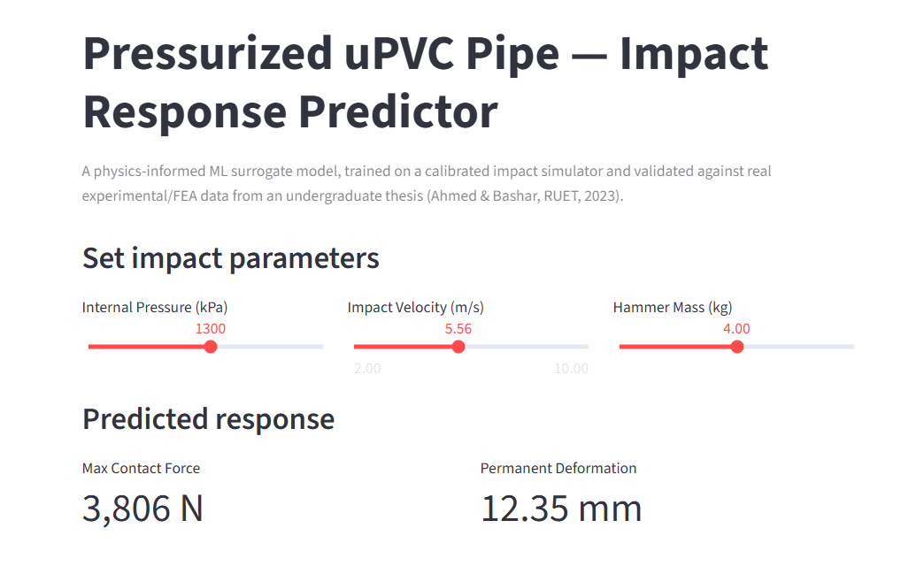

# Pipe Impact ML — Physics-Informed Surrogate Model for Pressurized Pipe Impact Response

**A machine learning surrogate model for predicting the low-velocity impact response of pressurized uPVC pipes — built on and validated against real undergraduate thesis data.**

[]()
[]()

📄 Extends: *"Behavior of Clamped uPVC Pipe with Different Internal Pressure Subjected to Low Velocity Impact"* (Ahmed & Bashar, BSc Thesis, RUET, 2023)



---

## Summary

My undergraduate thesis used **ABAQUS finite element analysis** and physical drop-hammer experiments to study how internal pressure affects a pipe's response to low-velocity impact — contact force, permanent deformation, pressure-pulse behavior. This project asks a follow-up question: **can a lightweight, open-source machine learning model learn to predict that same behavior, without needing commercial FEA software?**

I built a **reduced-order physics simulator** in Python (a pressure-dependent elastoplastic impact oscillator), **calibrated it against my thesis's real experimental/FEA data**, used it to generate a larger parametric dataset, and trained **Random Forest and XGBoost models** as fast surrogate predictors — all wrapped in an interactive Streamlit demo.

## Approach & Rigor

This project grew out of a genuine research progression, not a single leap:

1. **Thesis (2023):** experimental + ABAQUS FEA study of pressure's effect on pipe impact response.
2. **Exploratory regression (preliminary, `notebooks/00_exploratory_regression.py`):** simple linear vs. quadratic curve fits directly on the thesis's 5 data points, asking "is the pressure-response relationship linear or curved?" Found quadratic fits peak force far better (R²=0.998 vs 0.932) — an early sign of the saturation behavior near burst pressure that the thesis itself describes qualitatively. That analysis's own conclusion called for "a genuinely predictive surrogate model... a multi-feature regression or tree-based model... running additional simulations across pressure, velocity, and mass" — exactly what this repo builds.
3. **This repo:** a physics-informed simulator (replacing the need for more ABAQUS runs), calibrated against the same 5 real points, generating a full parametric dataset, feeding Random Forest / XGBoost surrogate models.

Every claim in this repo traces back to a real, physically grounded source:
- The simulator's structure (elastoplastic spring, pressure-stiffening) is derived from documented impact mechanics and the "string action" mechanism described in the source thesis.
- The simulator's free parameters are **calibrated by least-squares fit against 5 real experimental/FEA data points** — not guessed.
- Every result is validated against real thesis data the models never trained on, with errors reported honestly (2–16% typical, comparable to the thesis's own experimental-vs-FEA error of 16.93%).
- Known limitations are documented, not hidden (see below).

## Methodology

| Stage | What happens | File(s) |
|---|---|---|
| 1. Physics simulator | 1-DOF elastoplastic impact oscillator; pipe stiffness & yield force both increase with internal pressure (membrane "string action") | `simulator/impact_model.py` |
| 2. Calibration | `scipy.optimize.least_squares` fits 4 free parameters against 5 real thesis data points | `simulator/calibrate.py`, `data/real_thesis_data.csv` |
| 3. Dataset generation | Sweep pressure × velocity × hammer mass (1,170 simulated impacts) using the calibrated simulator | `simulator/generate_dataset.py` |
| 4. ML training | Random Forest & XGBoost regressors predict max contact force and permanent deformation | `models/train_models.py` |
| 5. Validation | Both models re-evaluated against the 5 real thesis points (never used in training) | same |
| 6. Interactive demo | Streamlit app: live prediction + comparison against real data | `app/app.py` |

## Key results

**Calibrated simulator vs. real thesis data (Table 4.3, ABAQUS FEA results):**

| Pressure (kPa) | Force Error | Deformation Error |
|---|---|---|
| 689.48 | -14.9% | -9.6% |
| 1034.21 | -8.5% | -4.0% |
| 1378.95 | -2.4% | -4.2% |
| 1723.69 | +5.4% | -3.3% |
| 2068.43 | +15.4% | +21.9% |

**ML models (Random Forest) on held-out real thesis data:** average absolute error ~9.4% (force), ~15.5% (deformation) — the ML step adds negligible error beyond the underlying simulator (Random Forest achieved R² = 1.0000 / 0.9912 on its own test set, meaning it faithfully reproduced simulator behavior).

**Feature importance:** peak force is driven almost entirely by pressure (importance = 1.000) — consistent with the thesis's core finding that internal pressure governs impact response, since force plateaus at the pipe's pressure-dependent yield threshold. Deformation is driven more by impact velocity (0.612) than pressure (0.210) or mass (0.178), since deformation depth scales with impact energy.

## Known limitations (read before citing this work)

- **Not a replacement for 3D FEA.** This is a reduced-order (1-DOF) approximation. It captures trends and orders of magnitude, not detailed stress/strain fields.
- **High-pressure overshoot.** The model assumes a linear pressure-yield relationship; real data shows this saturating near the pipe's burst pressure (thesis Fig. 4.16b). Error grows to ~15-22% above ~1700 kPa.
- **Fixed geometry.** Calibration is specific to the thesis's tested pipe (48.1mm OD, 2.75mm wall). Velocity and mass are swept because they're initial conditions, not calibrated constants — diameter/thickness are not swept, since doing so would require new calibration data.
- **R² = 1.0000 on the force test set** looks unusually perfect — this is expected for a smooth deterministic simulator (not noisy real-world sensor data), not a data leakage bug. Flagged here explicitly for transparency.

## Repo structure

```
simulator/           physics model + calibration (no external FEA software needed)
  impact_model.py     core elastoplastic impact simulator
  calibrate.py         fits simulator to real thesis data
  generate_dataset.py  sweeps parameters to build training data
data/
  real_thesis_data.csv     5 real data points from the thesis (ground truth)
  generated_dataset.csv    1,170 simulated impacts (training data)
  calibrated_params.json   fitted simulator constants
models/
  train_models.py       trains & evaluates Random Forest + XGBoost
app/
  app.py                Streamlit interactive demo
```

## Running the demo

```bash
conda create -n pipe_impact python=3.11 -y
conda activate pipe_impact
pip install -r requirements.txt

python -m simulator.calibrate         # calibrate simulator, ~instant
python -m simulator.generate_dataset  # generate 1,170-row dataset, ~instant
python -m models.train_models         # train RF + XGBoost, ~seconds
streamlit run app/app.py              # launch interactive demo
```

## Future work

- Model the high-pressure saturation with a nonlinear (e.g. exponential) yield-force function instead of linear.
- Extend to variable pipe geometry (diameter, wall thickness) with additional calibration data.
- Add signal-level modeling (FFT / LSTM) of the full pressure-pulse time series, not just peak values, using the thesis's Figures 4.1–4.5 as validation targets.

## Author

Ha-meem Ahmed — Department of Civil Engineering, Rajshahi University of Engineering & Technology
GitHub: [github.com/hameem474](https://github.com/hameem474)
